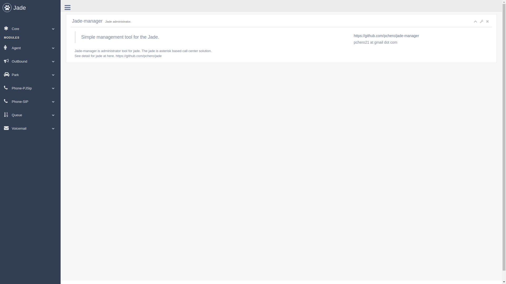

## jade-manager
Jade-manager is a free to use administrator tool for jade.

## Installing
Required jade(https://github.com/pchero/jade).

```
$ npm install
$ nodejs server.js
```

## Demo
You can try it at here.

http://project.pchero21.com/jade-manager/

[](./jade-manager.png)

## License
BSD License

## Remember 2014.04.16
* Still remember 2014.04.16
* Rest in peace..
* https://en.wikipedia.org/wiki/Sinking_of_MV_Sewol

